# Spring Security Training - Delivery Notes

**Project:** Spring Security Technical Training  
**Date:** September 2024  
**Audience:** Freshers / Junior Developers  
**Tech Stack:** Java 17, Spring Boot 3.3.3, Spring Security, PostgreSQL, JPA

---

## Table of Contents
1. [Project Overview](#project-overview)
2. [Key Dependencies](#key-dependencies)
3. [Commit-by-Commit Breakdown](#commit-by-commit-breakdown)
4. [Core Concepts Explained](#core-concepts-explained)
5. [Real-Life Examples](#real-life-examples)

---

## Project Overview

This project demonstrates how to implement **Spring Security** in a Spring Boot application. The journey shows the evolution from basic authentication mechanisms to a **custom, database-driven user authentication system**.

**What does it do?**
- Secures REST APIs with role-based access control
- Manages user credentials in PostgreSQL database
- Implements password encoding using BCrypt algorithm
- Demonstrates different authentication strategies

**Why is this important?**
- Security is critical in real-world applications
- Protecting user credentials and data is a legal and ethical requirement
- Spring Security is the industry standard for Java-based security

---

## Key Dependencies

### Spring Boot Starters

| Dependency | Purpose | Real-Life Use |
|---|---|---|
| `spring-boot-starter-security` | Provides security framework | Every production app needs this to protect APIs |
| `spring-boot-starter-web` | REST API creation | Building HTTP endpoints |
| `spring-boot-starter-data-jpa` | Database ORM | Mapping Java objects to database tables |
| `spring-boot-starter-jdbc` | Database connection | Raw SQL queries when needed |
| `postgresql` | Database driver | Connecting to PostgreSQL databases |
| `lombok` | Code generation | Reducing boilerplate (getters, setters, constructors) |

**Real-Life Example:**
Think of these dependencies as tools in a toolbox:
- `spring-boot-starter-security` = Lock & Key system
- `spring-boot-starter-data-jpa` = Librarian (manages books/data)
- `postgresql` = The actual library (database storage)
- `lombok` = Assistant (writes repetitive code for you)

---

## Commit-by-Commit Breakdown

### Commit 1: Initial Setup
**SHA:** `0fe0353c7b046dbbcd4d93824fa226137713149a`  
**Message:** Initial Spring Boot Project Setup  
**Changes:** Project scaffolding with pom.xml and basic dependencies

**What was done:**
- Created Maven project structure
- Added Spring Boot parent POM
- Configured Java 17
- Added core dependencies

**Why:**
Every project needs a solid foundation. This is like building the foundation of a house before adding walls.

---

### Commit 2: Project Configuration
**SHA:** `9777d17dc9428c49de6007988d2ec7a1e137a27f`  
**Message:** Add ProjectConfig class  
**Files Changed:** `src/main/java/com/scb/chennai/ursa/config/ProjectConfig.java`

**What was done:**
```java
@Configuration
public class ProjectConfig {
    @Bean
    SecurityFilterChain defaultSecurityFilterChain(HttpSecurity http) throws Exception {
        // Configure security rules
    }
    
    @Bean
    public PasswordEncoder passwordEncoder(){
        return PasswordEncoderFactories.createDelegatingPasswordEncoder();
    }
}
```

**Detailed Explanation:**

#### `@Configuration` Annotation
- Tells Spring this is a configuration class
- Methods marked with `@Bean` will be managed by Spring Container

**Real-Life Analogy:**
Imagine a restaurant:
- `@Configuration` = Manager
- `@Bean` = Kitchen appliances (registered and managed by manager)
- Spring Container = Restaurant owner (provides appliances when needed)

#### SecurityFilterChain
**What it does:** Controls which URLs require authentication and which don't

```
Without SecurityFilterChain:
User → Browser → All routes BLOCKED (default behavior)

With SecurityFilterChain:
User → /accounts → Authentication Required ✓
User → /notices → Public Access ✓
User → /error   → Public Access ✓
```

**Code Breakdown:**
```java
.requestMatchers("/accounts","/balance","/loans","/cards").authenticated()
// These endpoints need login
  
.requestMatchers("/notices","/contact","/error").permitAll()
// These endpoints are public
```

**Real-Life Example - Bank Application:**
```
Protected Routes (Need Login):
✓ /accounts - View your account details
✓ /balance - Check balance
✓ /loans - Apply for loans
✓ /cards - Manage credit cards

Public Routes (No Login Required):
✓ /notices - Public announcements
✓ /contact - Contact us
✓ /error - Error pages
```

#### PasswordEncoder
**Why we need it:** Storing passwords in plain text is dangerous!

```
❌ WRONG: 
Database: user@email.com -> password123

✅ RIGHT:
Database: user@email.com -> $2a$12$d8OWp4lXVmFjV0/II1bvluIJdOiujCA2zFaku3uIPv35A7ea5ZVXK
          (BCrypt encrypted)
```

**PasswordEncoderFactories.createDelegatingPasswordEncoder()**
- Uses BCrypt (industry standard)
- Adds random salt to prevent rainbow table attacks
- One-way encryption (cannot be reversed)

**Real-Life Example:**
```
User enters password: "SecurePass123"
↓
BCryptPasswordEncoder.encode()
↓
Result: "$2a$10$aAbCdEfGhIjKlMnOpQrStU..." (different every time)
↓
Stored in database

Later, user logs in with "SecurePass123":
↓
BCryptPasswordEncoder.matches(userInput, storedHash)
↓
Returns: true/false
```

**Why it's different each time:**
```
encode("password") → $2a$10$XYZ...ABC (first time)
encode("password") → $2a$10$DEF...XYZ (second time)

Both decrypt to "password" but look different!
This makes it impossible to create password tables.
```

---

### Commit 3: In-Memory User Details
**SHA:** `33bb2ef027892885c6354742160ed7b441ae58b2`  
**Message:** Add In-Memory User Authentication  
**Files Changed:** `ProjectConfig.java`

**What was done:**
Added commented UserDetailsService:
```java
@Bean
public UserDetailsService userDetailsService(){
    UserDetails user= User.withUsername("user")
            .password("{noop}password")
            .authorities("READ")
            .build();
    
    UserDetails admin= User.withUsername("admin")
            .password("{bcrypt}$2a$12$d8OWp4lXVmFjV0/II1bvluIJdOiujCA2zFaku3uIPv35A7ea5ZVXK")
            .authorities("ADMIN")
            .build();
    
    return new InMemoryUserDetailsManager(user, admin);
}
```

**Why this approach (and its limitations):**

**Pros:**
- ✓ Good for learning
- ✓ No database needed
- ✓ Fast testing

**Cons:**
- ✗ Users hardcoded in code
- ✗ Can't add new users without recompiling
- ✗ Not suitable for production
- ✗ Changes require restarting server

**Real-Life Analogy:**
```
In-Memory = Guest list written on paper (bring paper everywhere)
Database   = Bouncer with access to central system (scalable)
```

**{noop} vs {bcrypt} prefix:**
```
{noop}password        → No operation (plain text) - NEVER use in production!
{bcrypt}$2a$12$...    → Uses BCrypt algorithm - GOOD!
{sha256}...           → Uses SHA-256 - OKAY but BCrypt is better
```

---

### Commit 4: JDBC User Details Manager
**SHA:** `3f1e20c3a586c087574c7c3ad401f55048974d72`  
**Message:** Add JDBC-based User Authentication  
**Files Changed:** `ProjectConfig.java`

**What was done:**
Switched from In-Memory to Database:
```java
@Bean
public UserDetailsService userDetailsService(DataSource dataSource) {
    return new JdbcUserDetailsManager(dataSource);
}
```

**What is JDBC?**
JDBC = Java Database Connectivity
- Direct SQL queries to database
- Lower-level database access
- More control but more complex

**Database Schema Expected:**
```sql
-- Standard Spring Security schema
CREATE TABLE users (
    username VARCHAR(50) NOT NULL,
    password VARCHAR(500) NOT NULL,
    enabled BOOLEAN NOT NULL,
    PRIMARY KEY (username)
);

CREATE TABLE authorities (
    username VARCHAR(50) NOT NULL,
    authority VARCHAR(50) NOT NULL,
    FOREIGN KEY (username) REFERENCES users(username)
);
```

**Advantages over In-Memory:**
- ✓ Users stored in database
- ✓ Can add new users without code changes
- ✓ Passwords persisted securely
- ✓ Production-ready
- ✗ Requires predefined Spring Security schema

**Real-Life Use Case:**
```
User registers on website
↓
INSERT into users table
↓
encode password with BCrypt
↓
User can immediately login

No server restart needed!
```

---

### Commit 5: Initial Custom UserDetailsService Setup
**SHA:** `3ebd6594f8d3029a0768ace3910cb378013a13e4`  
**Message:** Add Customer Model and Repository

**Files Added:**
1. `Customer.java` (Entity)
2. `CustomerRepository.java` (Data Access)

#### Customer.java (JPA Entity)
```java
@Entity
@Table(name = "customer")
public class Customer {
    @Id
    @GeneratedValue(strategy = GenerationType.IDENTITY)
    private long id;
    private String email;
    private String pwd;
    @Column(name = "role")
    private String role;
}
```

**Explanation:**

**@Entity:** 
- Tells Spring this maps to a database table
- Hibernate/JPA manages this class

**@Id:**
- Primary key of the table
- Uniquely identifies each record

**@GeneratedValue(strategy = GenerationType.IDENTITY):**
```
When we INSERT into customer table:
INSERT INTO customer (email, pwd, role) 
VALUES ('john@email.com', 'hashedpwd', 'USER')

Database automatically assigns:
id = 1, 2, 3, ... (auto-increment)
```

**Real-Life Example:**
```
Creating a customer record:
Customer customer = new Customer();
customer.setEmail("john.doe@bank.com");
customer.setPwd("$2a$10$encrypted_password");
customer.setRole("CUSTOMER");

//Save to database
customerRepository.save(customer);

// Result in database:
// id: 1
// email: john.doe@bank.com
// pwd: $2a$10$encrypted_password
// role: CUSTOMER
```

#### CustomerRepository.java
```java
@Repository
public interface CustomerRepository extends JpaRepository<Customer, Long> {
    Optional<Customer> findCustomerByEmail(String email);
}
```

**Why extend JpaRepository?**
- Automatically generates CRUD operations
- No need to write SQL queries
- Spring Data magic!

**JpaRepository provides:**
```java
save(Customer)              // Insert/Update
findById(Long)              // SELECT by ID
delete(Customer)            // Delete
findAll()                   // SELECT all

// Custom method (we defined):
findCustomerByEmail(String) // SELECT by email
```

**Real-Life Usage:**
```java
// Finding a customer by email
Optional<Customer> customer = customerRepository.findCustomerByEmail("john@email.com");

if (customer.isPresent()) {
    System.out.println("Found: " + customer.get().getEmail());
} else {
    System.out.println("Customer not found");
}
```

---

### Commit 6: TTPUserDetailsService Implementation
**SHA:** `aeb4afafa28fcc48fadc54c01fa595ed504c77dc`  
**Message:** Add TTPUserDetailsService  
**Files Changed:** `ProjectConfig.java` (commented JdbcUserDetailsManager)  
**Files Added:** `TTPUserDetailsService.java`

**This is the MAIN COMPONENT - the custom authentication!**

#### What is UserDetailsService?
Interface that Spring Security uses to load user details:
```java
public interface UserDetailsService {
    UserDetails loadUserByUsername(String username) throws UsernameNotFoundException;
}
```

#### TTPUserDetailsService Implementation
```java
@Service
@RequiredArgsConstructor
public class TTPUserDetailsService implements UserDetailsService {
    
    private final CustomerRepository customerRepository;
    
    @Override
    public UserDetails loadUserByUsername(String username) throws UsernameNotFoundException {
        // Step 1: Find customer by email
        Customer customer = customerRepository
            .findCustomerByEmail(username)
            .orElseThrow(() -> new UsernameNotFoundException("User not found for " + username));
        
        // Step 2: Convert role to Authority
        List<GrantedAuthority> authorities = List.of(
            new SimpleGrantedAuthority(customer.getRole())
        );
        
        // Step 3: Return Spring Security UserDetails
        return new User(customer.getEmail(), customer.getPwd(), authorities);
    }
}
```

**Step-by-Step Flow (with Real Example):**

**User attempts login with email: "john@bank.com" and password: "myPassword123"**

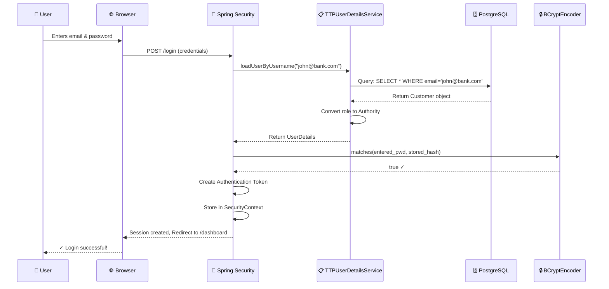

**Key Concepts:**

1. **@Service:** 
   - Spring component for business logic
   - Registered in application context
   - Can be injected into other classes

2. **@RequiredArgsConstructor:**
   - Lombok annotation (reduces boilerplate)
   - Creates constructor with required fields
   - Enables dependency injection

3. **Optional Pattern:**
   ```java
   Optional<Customer> result = customerRepository.findCustomerByEmail("test@email.com");
   
   // Avoid null pointer exceptions!
   Customer customer = result.orElseThrow(
       () -> new UsernameNotFoundException("User not found")
   );
   ```

4. **GrantedAuthority:**
   - Represents user permissions
   - Example: "CUSTOMER", "ADMIN", "MANAGER"
   - Used in authorization decisions

**Real-Life Banking Scenario:**

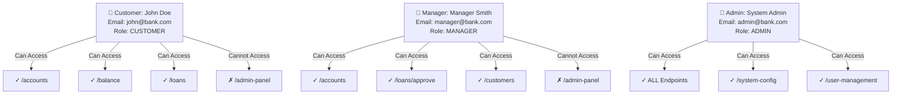

**Security Filter Chain with Custom Service:**

```
Incoming Request with credentials
        ↓
Spring Security AuthenticationFilter
        ↓
Calls: userDetailsService.loadUserByUsername("email")
        ↓
TTPUserDetailsService queries database
        ↓
Returns User object with authorities
        ↓
PasswordEncoder compares passwords
        ↓
Creates Authentication token
        ↓
SecurityContext stores authenticated user
        ↓
Request allowed or denied based on authorities
```

---

### Commit 7: Password Encoder Addition (Latest)
**SHA:** `f2c04e1cf6ae8869f998d550f92d70bdfad0cd56`  
**Message:** Added Password Encoder  

This commit confirms the PasswordEncoder bean is properly configured.

---

## Core Concepts Explained

### 1. Authentication vs Authorization

| Concept | Definition | Example |
|---------|-----------|---------|
| **Authentication** | Verify WHO you are | Username + Password login |
| **Authorization** | Verify WHAT you can do | User can access /balance but not /admin |

**Real-Life Analogy:**
```
Airport Security:
✓ Authentication: Show passport/ID at security gate
  "Are you really John Doe?" → YES
  
✓ Authorization: Check boarding pass
  "Can you board flight AA123?" → YES
  "Can you access pilot cockpit?" → NO
```

### 2. SecurityFilterChain

Spring Security works through a chain of filters:

```mermaid
graph LR
    A["HTTP Request"] --> B["SecurityContextPersistenceFilter"]
    B --> C["HeaderWriterFilter"]
    C --> D["CorsFilter"]
    D --> E["CsrfFilter"]
    E --> F["LogoutFilter"]
    F --> G["UsernamePasswordAuthenticationFilter⭐"]
    G --> H["BasicAuthenticationFilter"]
    H --> I["AuthorizationFilter"]
    I --> J["Your Controller"]
    J --> K["HTTP Response"]
    
    style G fill:#FFE6E6
```

### 3. The Authentication Flow

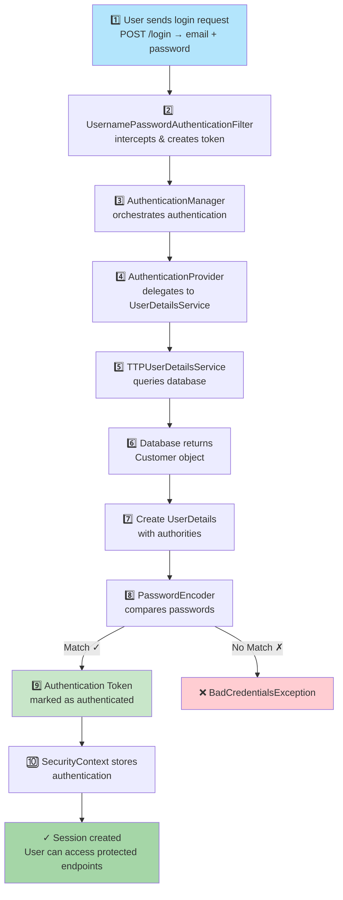

### 4. Role-Based Access Control (RBAC)

**How it works:**

```java
// In ProjectConfig:
.requestMatchers("/accounts").authenticated()
// Any authenticated user can access

// In controller:
@GetMapping("/admin-only")
@PreAuthorize("hasRole('ADMIN')")
public String adminPage() {
    return "Admin page";
}

// Or in SecurityFilterChain:
.requestMatchers("/admin/**").hasRole("ADMIN")
.requestMatchers("/manager/**").hasAnyRole("MANAGER", "ADMIN")
```

**Real-Life Scenario - Authorization Decision Tree:**

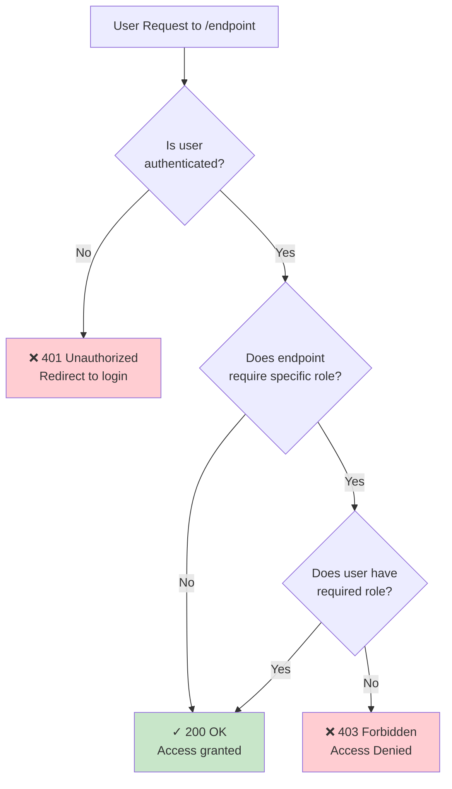

---

## Real-Life Examples

### Example 1: Complete Login Flow for Bank Application

**Scenario: Customer John Doe logs in**

**Database State (Before Login):**
```
customer table:
id  | email            | pwd                          | role
----|------------------|------------------------------|----------
1   | john@example.com | $2a$10$encryptedPasswordHash | CUSTOMER
2   | admin@bank.com   | $2a$10$adminPasswordHash     | ADMIN
```

**Detailed Login Flow - Mermaid Diagram:**

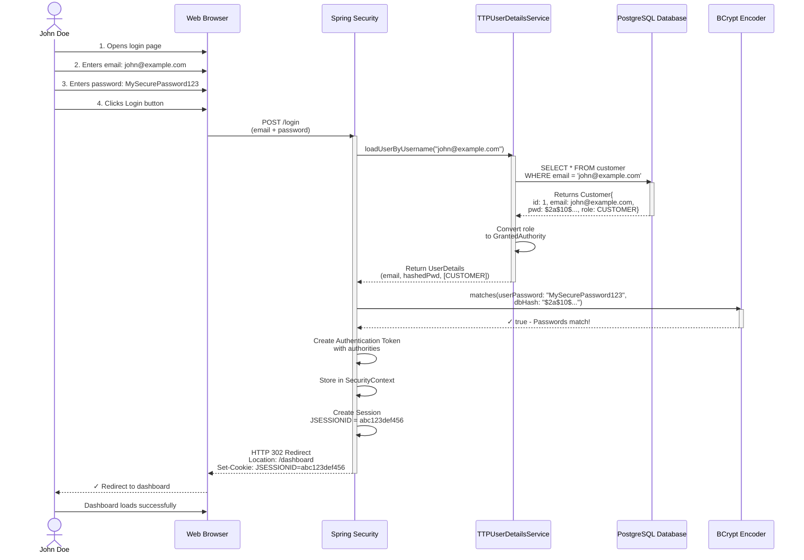

**After Login - Request to Protected Endpoint:**

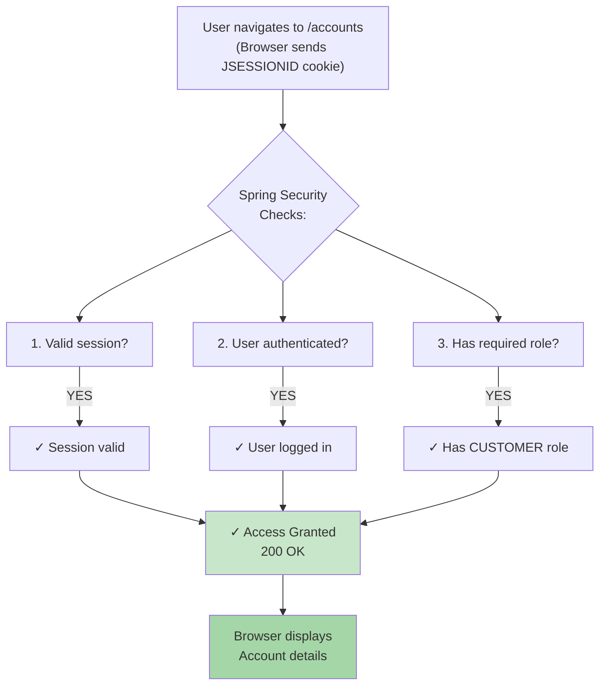

**Request to Unauthorized Endpoint:**

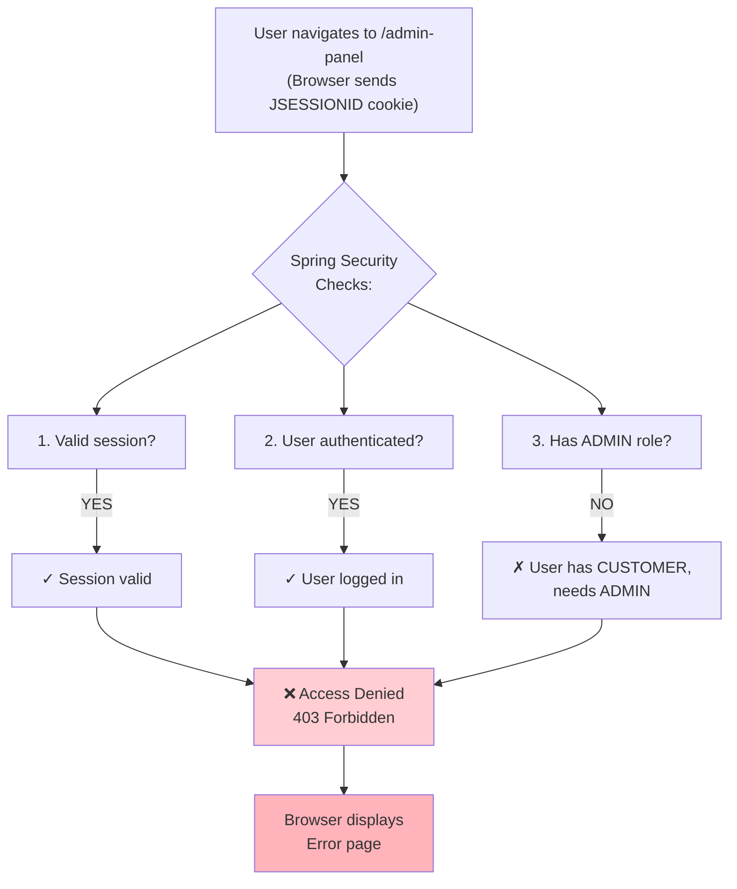

### Example 2: Registering a New Customer

**Scenario: New customer Sarah signs up**

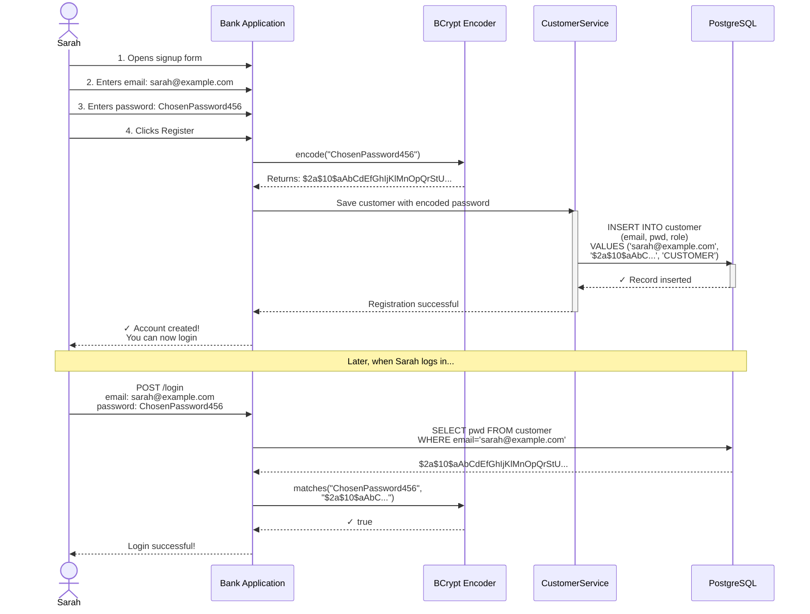

### Example 3: Password Encoding Security

```mermaid
graph TD
    A["User Registration<br/>Password: MyPassword123"] --> B["BCrypt Encoder"]
    B --> C["Hash 1: $2a$10$aAbCdEfGhIjKlMnOpQrStU..."]
    
    A2["User Registration Again<br/>Password: MyPassword123"] --> B2["BCrypt Encoder<br/>(with different salt)"]
    B2 --> C2["Hash 2: $2a$10$dEfGhIjKlMnOpQrStUvWxY..."]
    
    subgraph DB["Database Storage"]
        C --> D["✓ Stored securely<br/>(Different hash each time!)"]
        C2 --> D
    end
    
    subgraph Attack["If Database Hacked"]
        D --> E["Attacker sees:<br/>$2a$10$aAbCdEfGhIjKlMnOpQrStU..."]
        D --> F["Cannot use hash directly"]
        D --> G["Cannot crack (computationally hard)"]
        D --> H["Cannot use rainbow tables<br/>(due to unique salt)"]
        E --> I["❌ Cannot login"]
        F --> I
        G --> I
        H --> I
    end
    
    style D fill:#C8E6C9
    style I fill:#A5D6A7
```

### Example 4: Authorization in Practice

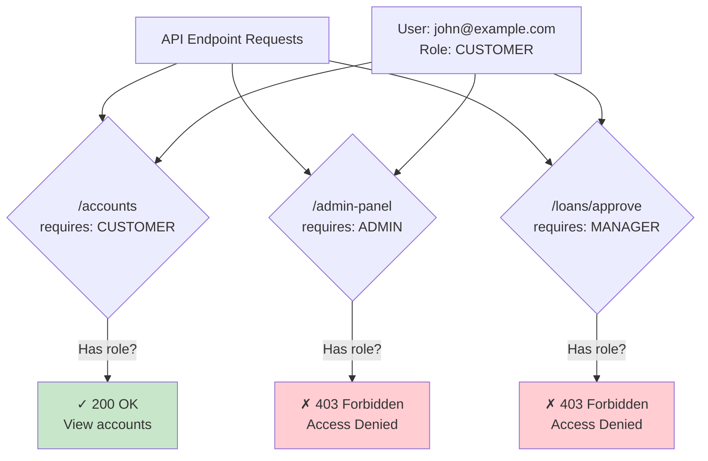

---

## Architecture Diagram

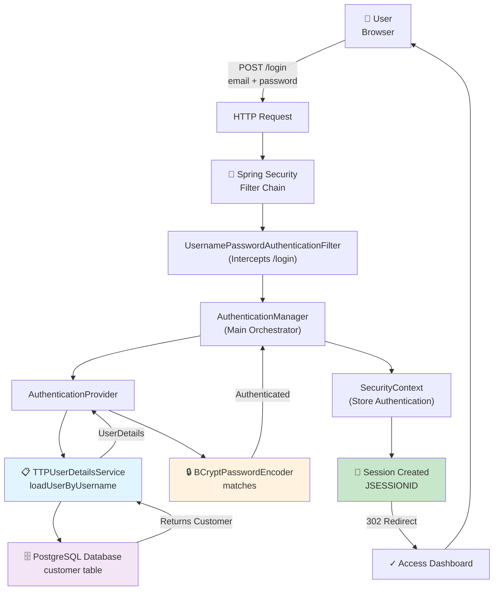

---

## Summary for Training

### Key Takeaways

1. **Authentication ≠ Authorization**
   - Auth: "Who are you?" (login)
   - Authz: "What can you do?" (permissions)

2. **Never store plain passwords**
   - Always use BCrypt or similar
   - Add salt for extra security
   - One-way encryption only

3. **Custom UserDetailsService**
   - Implement when you have custom user model
   - Query database for user details
   - Return Spring Security UserDetails object

4. **Roles and Authorities**
   - Control what authenticated users can access
   - Define in security config
   - Check in controllers with @PreAuthorize

5. **Spring Security Flow**
   - Request → Filter → Provider → UserDetailsService → Database → Authentication → Authorization

### Common Mistakes to Avoid

❌ Storing passwords in plain text  
❌ Hardcoding credentials in code  
❌ Forgetting to encode passwords during registration  
❌ Using old/weak hashing algorithms  
❌ No authorization checks (everyone gets same access)  
❌ Debugging with passwords in logs  

### What's Next?

After this training, students should explore:
- JWT (JSON Web Tokens) for stateless authentication
- OAuth2 for third-party authentication
- Method-level security with @PreAuthorize/@PostAuthorize
- CORS (Cross-Origin Resource Sharing) configuration
- Spring Security with microservices
- Advanced role hierarchies

---

## Quick Reference

### Important Classes & Interfaces

| Class/Interface | Purpose | Package |
|---|---|---|
| `UserDetailsService` | Load user from storage | `o.s.s.core.userdetails` |
| `UserDetails` | User with authorities | `o.s.s.core.userdetails` |
| `PasswordEncoder` | Encode/validate passwords | `o.s.s.crypto.password` |
| `SecurityFilterChain` | HTTP security config | `o.s.s.web` |
| `AuthenticationManager` | Main auth orchestrator | `o.s.s.authentication` |
| `JpaRepository` | Database operations | `o.s.d.jpa.repository` |
| `@Entity` | JPA entity mapping | `jakarta.persistence` |

### Key Annotations

| Annotation | Use | Example |
|---|---|---|
| `@Configuration` | Spring config class | `@Configuration public class ProjectConfig` |
| `@Bean` | Spring-managed object | `@Bean public PasswordEncoder encoder()` |
| `@Entity` | JPA table mapping | `@Entity @Table(name="customer")` |
| `@Repository` | Data access layer | `@Repository public interface CustomerRepository` |
| `@Service` | Business logic layer | `@Service public class TTPUserDetailsService` |
| `@PreAuthorize` | Method-level security | `@PreAuthorize("hasRole('ADMIN')")` |

---

**Document Version:** 2.0 (Enhanced with Mermaid Diagrams)  
**Last Updated:** September 2024  
**Suitable For:** Freshers & Junior Developers  
**Prerequisites:** Basic Java, Spring Boot basics, Database fundamentals
